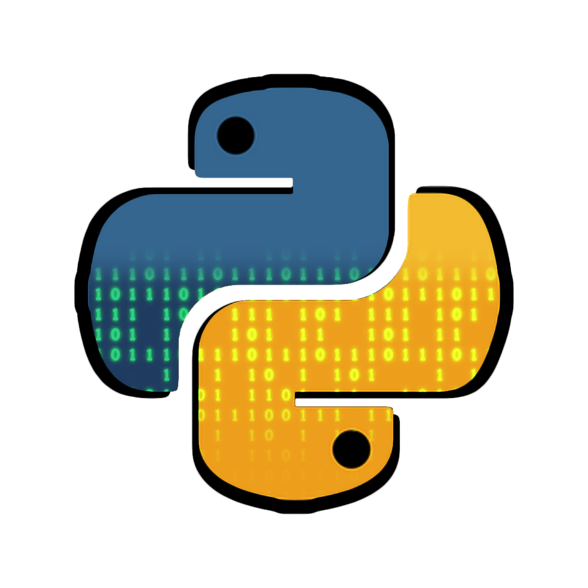

<p align="center">
    
</p>

# ComPy

An efficient and simple static Python to C++ source-to-source compiler.

## Background

The motive behind this project comes from there being almost no _native_
transpilers for Python to other languages. At some point in the process,
they eventually rely on some interpreter or Python wrapper of some sort
(if you want a Python static compiler which is already in stable versions,
check out the [mypy](https://github.com/python/mypy) /
[mypyc](https://github.com/mypyc/mypyc) projects).

The only project I managed to find which doesn't do this is the
[transpyle](https://github.com/mbdevpl/transpyle/) project, but
unfortunately it appears to have been abandoned for a few years
now. It also does not include all the Python features, which is
what I plan on including in this project.

In the end, this compiler will take Python code and output native
(no weird wrapper classes) C++ code. This will give it peak
efficiency and will offer other benefits, such as porting Python
code to C++ projects, or vice versa.

## Installation

Open a command prompt and run:
```cmd
python -m pip install -r requirements.txt
```
In future versions, we will hopefully have a `setup.py` file
to automatically install dependencies and such.

## Syntax Subset

In order to achieve the feat of compiling a duck-typed language,
ComPy leverages the aid of type annotations. These annotations
must be used on all annotatable names (objects)- variables,
functions (return types), and function arguments. However,
only the first time an object is initialized, the annotation
must be used. This is similar to a lower level langauge:

```c
// This is a snippet of C code
// You must use the type when initializing
int my_var = 1;

// However, when updating the value, no type is needed
my_var = 5;

// Usage of the object also requires no type annotations
printf("%i", my_var);
```

The above code initializes an integer variable with the name
`my_var`, assigns it the initial value of `1`, then later
replaces this value with the number `5`. Afterwards, it prints
the value of `my_var` to the screen. If we were to reimplement
this code in the ComPy syntax subset, it would look like so:

```python
# Use type hint on initialization
my_var: int = 1

# No need for type hint afterwards
my_var = 5

# Again, usage does not need type hints
print(my_var)
```

## Command Line Usage

Help menu, describes all command-line arguments:

```text
usage: compy.py [-h] [-o OUTPUT] [-l LINKS] [-g] [-c] [-dg] [-dt] [-di] file

positional arguments:
  file                  The file to compile

optional arguments:
  -h, --help            show this help message and exit
  -o OUTPUT, --output OUTPUT
                        The file to output the ASM code to
  -l LINKS, --links LINKS
                        Links the ported libraries to the executable (seperate with the ; character)
  -g, --compile         Compiles the output to an executable (you must have g++ installed and on the PATH)
  -c, --compress        Compresses the output executable (you must have UPX installed and on the PATH)
  -dg, --debug-gui      Opens the debugging GUI, mainly used to display information about the AST
  -dt, --debug-text     Prints out more logging information, mainly the AST tree in text form
  -di, --debug-image    Renders the AST as an image
```

Basic compilation (transpilation) of Python code:

```cmd
python compy.py examples\test_code.py
```

Compile the Python code in `examples\test_code.py` and output
the C++ code to the file `examples\test_code.cpp`:

```cmd
python compy.py -o examples\test_code.cpp examples\test_code.py
```

Compile the Python code to a native executable (requires you to have `g++` installed!):

```cmd
python compy.py -g examples\test_code.py
```

## Advanced Usage

This section will primarily explain how "ported objects"
work, and how you can implement your own. Let's start with the
defenition- in ComPy, a "ported object" (or _"port"_, as it
might be called) is a snippet of code in the native langauge
(C++), which has the capability to be interacted with via the
Python code. What this all means in the end is that you can
write Python code, and you can "inject" snippets of native C++
wherever you'd like.

The benefit of this is that we can now not only interact with
our Python code by transpiling it into C++, but we can now do
the opposite by taking C++ code and "turning it into Python"
(it's not actually transpiling the native code to Python, it
simply allows for the transpiler to link these objects together
again when it's time to transpile back to native code).

That's a lot of explanation- let's see some examples. If you
view `examples/example_port.py`, you'll see an example ported
library. One of the objects in that library is an example
"addition" operator function called `add`:

```python
def add(number_one: int, number_two: int) -> int:
	"""
	Adds two numbers.
	"""
```

A few lines down, we then add it to the object storage like so:

```python
ported_objs: Dict[str, PyPortFunctionSignature] = {

	"add": PyPortFunctionSignature(
		function=add,
		code="return number_one + number_two;"
	)

}
```

In the above snippet, we assigned a Python function with the
name `add` to a ported function. This ported function has a
reference to the function we defined earlier, also named
`add` (in the `function` parameter). Now, ComPy knows the
function's signature (arguments and return type). Finally,
the last thing we need to specify is what the ported
function does in native code. We specify this in the `code`
parameter, by writing the code that the function will run.

Finally, in the test script `examples\test_code.py`, we call
the function (the line above it is so that PyCharm ignores it,
as we am technically calling a function that does not exist):

```python
# noinspection PyUnresolvedReferences
c = add(c, b)
```

Now, when this code segment is compiled, ComPy spits out the
following snippet to the output (the valid C++ code equivalent):
```cpp
int add(int number_one, int number_two){return number_one + number_two;}

...

c = add(c,b);
```